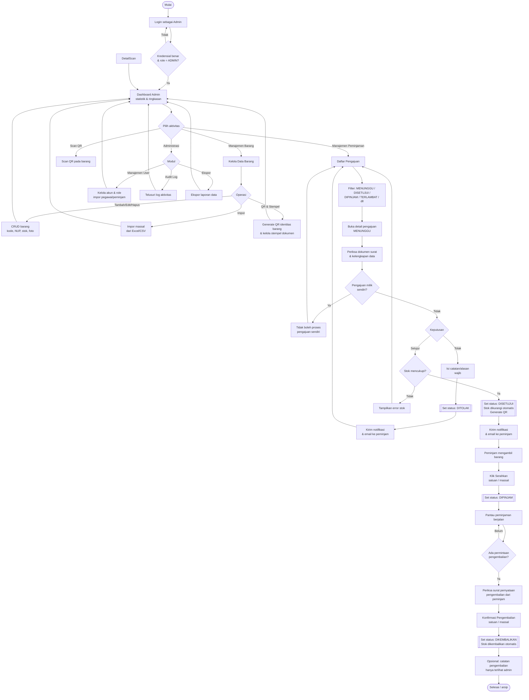
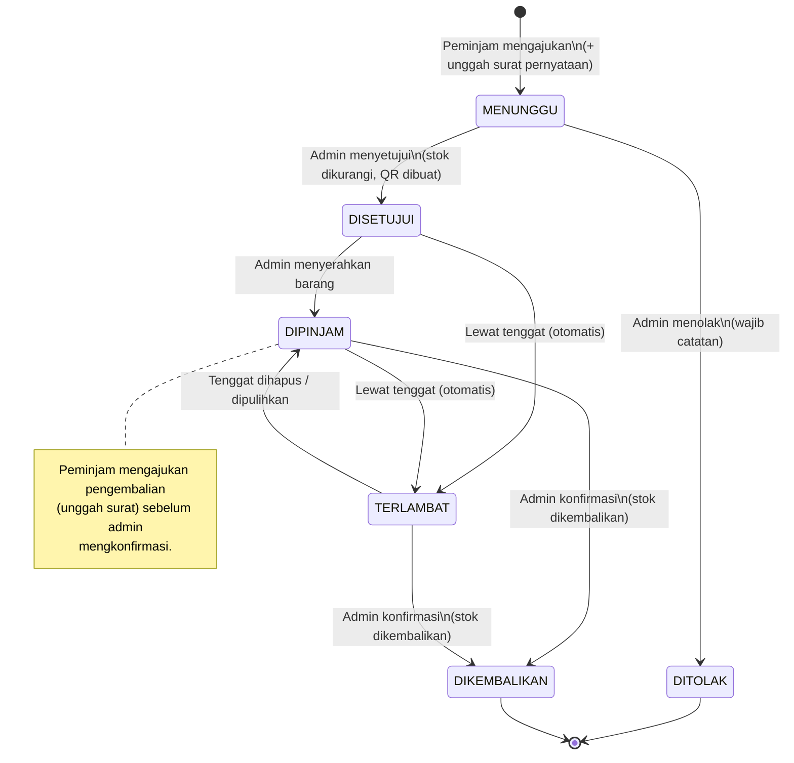
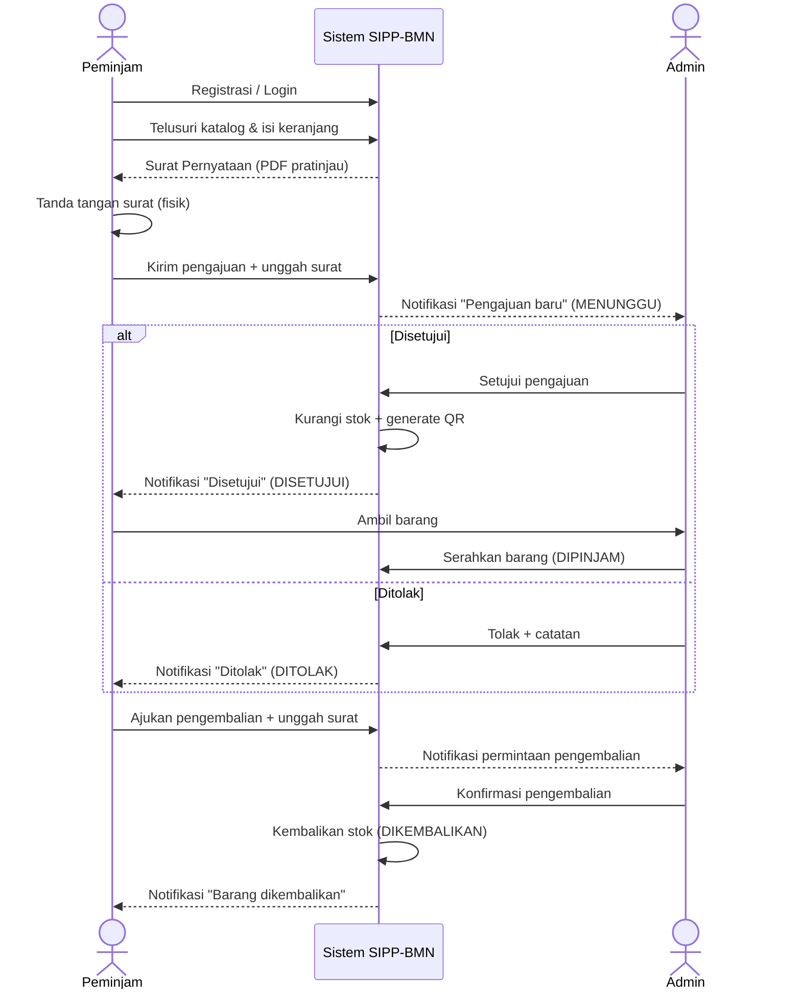

# Alur Kerja SIPP-BMN — Admin & Peminjam

Dokumen ini memuat **flowchart lengkap dari awal hingga akhir** untuk masing-masing
peran: **Peminjam** dan **Admin**. Semua diagram ditulis dalam sintaks **Mermaid**
sehingga dapat dirender langsung di GitHub, VS Code (dengan ekstensi Mermaid),
Obsidian, dan sebagian besar penampil Markdown modern.

Status peminjaman yang dipakai sistem:
`MENUNGGU → DISETUJUI → DIPINJAM → DIKEMBALIKAN`, dengan cabang `DITOLAK`
dan status otomatis `TERLAMBAT` (bila melewati tenggat).

---

## 1. Alur Peminjam (dari awal hingga akhir)

```mermaid
flowchart TD
    Start([Mulai]) --> Punya{Sudah punya akun?}
    Punya -- Belum --> Reg[Registrasi:\nnama, NIP, email, password,\nEselon III & IV]
    Reg --> RegCek{Email / NIP\nsudah terdaftar?}
    RegCek -- Ya --> RegGagal[Tampilkan error\nEmail/NIP sudah dipakai]
    RegGagal --> Reg
    RegCek -- Tidak --> Akun[Akun dibuat\nrole = PEMINJAM]
    Akun --> Login
    Punya -- Sudah --> Login[Login\nemail + password]
    Login --> LoginCek{Kredensial benar?}
    LoginCek -- Tidak --> Login
    LoginCek -- Ya --> Dash[Dashboard Peminjam]

    Dash --> Katalog[Telusuri Katalog Barang]
    Katalog --> Pilih[Pilih barang + jumlah\nMasukkan ke Keranjang]
    Pilih --> Lagi{Tambah barang lain?}
    Lagi -- Ya --> Katalog
    Lagi -- Tidak --> FormAju[Isi form pengajuan:\ntanggal pinjam & kembali rencana,\nalasan, pangkat/golongan]

    FormAju --> Preview[Pratinjau & Unduh\nSurat Pernyataan Peminjaman PDF]
    Preview --> TTD[Tanda tangan surat\nsecara fisik / elektronik]
    TTD --> Upload[Unggah kembali\nsurat yang sudah ditandatangani]
    Upload --> Kirim[Kirim Pengajuan]

    Kirim --> Valid{Lolos validasi?\n- maks 3 peminjaman aktif\n- tidak duplikat barang aktif\n- stok cukup\n- dokumen terlampir}
    Valid -- Tidak --> ErrAju[Tampilkan pesan error]
    ErrAju --> FormAju
    Valid -- Ya --> Menunggu[[Status: MENUNGGU]]

    Menunggu --> Notif1[Terima notifikasi\n& email konfirmasi]
    Notif1 --> Tunggu[Menunggu keputusan admin]

    Tunggu --> Keputusan{Keputusan Admin}
    Keputusan -- Ditolak --> Ditolak[[Status: DITOLAK]]
    Ditolak --> LihatAlasan[Lihat alasan penolakan\ndi Riwayat]
    LihatAlasan --> Selesai1([Selesai])

    Keputusan -- Disetujui --> Disetujui[[Status: DISETUJUI]]
    Disetujui --> AmbilBarang[Ambil barang ke petugas\nAdmin menyerahkan barang]
    AmbilBarang --> Dipinjam[[Status: DIPINJAM]]

    Dipinjam --> CekWaktu{Melewati tenggat\npengembalian?}
    CekWaktu -- Ya --> Terlambat[[Status: TERLAMBAT]]
    CekWaktu -- Tidak --> MauKembali[Ingin mengembalikan]
    Terlambat --> MauKembali

    MauKembali --> UnduhKembali[Unduh Surat Pernyataan\nPengembalian PDF]
    UnduhKembali --> TTDKembali[Tanda tangan\n Yang menerima BMN ]
    TTDKembali --> UploadKembali[Unggah surat pengembalian\n+ Ajukan Pengembalian]
    UploadKembali --> MintaKembali[[Permintaan pengembalian\nmenunggu konfirmasi admin]]
    MintaKembali --> TungguKonfirm[Menunggu admin\nmengkonfirmasi]
    TungguKonfirm --> Dikembalikan[[Status: DIKEMBALIKAN]]
    Dikembalikan --> Riwayat[Peminjaman tercatat\ndi Riwayat]
    Riwayat --> Selesai2([Selesai])
```

---

## 2. Alur Admin (dari awal hingga akhir)

---

## 3. Diagram Status Peminjaman (State Machine)

Ringkasan transisi status yang dikelola sistem — berguna untuk memahami
siapa yang memicu tiap perpindahan.

---

## 4. Interaksi Peminjam ↔ Admin (Sequence)

Alur satu siklus peminjaman utuh dari sudut pandang komunikasi kedua peran
dan sistem.

---

### Catatan

- **Registrasi publik** selalu menghasilkan akun ber-role `PEMINJAM`. Akun `ADMIN`
  dibuat/diatur melalui manajemen user.
- **Batas peminjaman aktif** per peminjam standarnya **3** (`MENUNGGU`, `DISETUJUI`,
  `DIPINJAM`, `TERLAMBAT`). Barang yang sama tidak bisa diajukan dua kali selama
  peminjaman sebelumnya belum selesai.
- **Surat pernyataan** (peminjaman & pengembalian) di-generate sistem, ditandatangani
  di luar sistem, lalu diunggah kembali sebagai lampiran wajib.
- **TERLAMBAT** ditentukan otomatis berdasarkan tanggal; peminjaman tanpa tenggat
  tidak pernah menjadi terlambat.
- **Catatan pengembalian** hanya terlihat oleh admin, tidak pernah dikirim ke peminjam.
