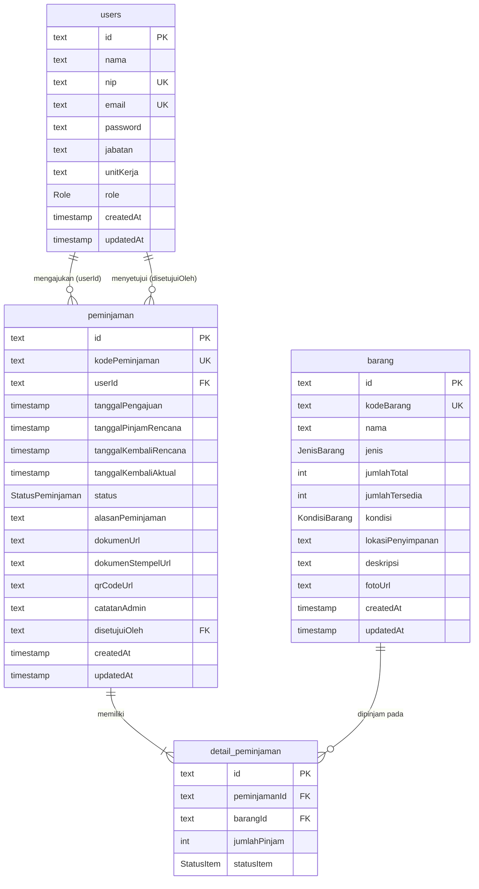

# 🗄️ Database PostgreSQL — SIPP-BMN

Dokumen ini menjelaskan struktur database **PostgreSQL** untuk aplikasi **Sistem Informasi Peminjaman & Pengembalian Barang Milik Negara (SIPP-BMN)**, lengkap dengan **skema, relasi, indeks, SQL DDL siap pakai, dan data awal (seed)**.

Skema ini **identik** dengan `prisma/schema.prisma`. Anda bebas memilih cara membuat database:

- **Cara 1 (disarankan):** otomatis dari Prisma → `npx prisma migrate dev`
- **Cara 2:** jalankan SQL DDL di bawah secara manual (psql / SQL Editor Supabase / Neon)

---

## 1. Ringkasan

| Objek            | Nama                                                        |
| ---------------- | ----------------------------------------------------------- |
| Nama database    | `sipp_bmn` (bebas; cocokkan dengan `DATABASE_URL`)          |
| Jumlah tabel     | 4 → `users`, `barang`, `peminjaman`, `detail_peminjaman`    |
| Jumlah enum      | 5 → `Role`, `JenisBarang`, `KondisiBarang`, `StatusPeminjaman`, `StatusItem` |
| Tipe primary key | `TEXT` berisi UUID (di-generate oleh aplikasi/Prisma)       |
| Tipe tanggal     | `TIMESTAMP(3)`                                              |

---

## 2. Diagram Relasi (ERD)



---

## 3. Enum (Tipe Data PostgreSQL)

| Enum               | Nilai                                                              |
| ------------------ | ----------------------------------------------------------------- |
| `Role`             | `ADMIN`, `PEMINJAM`                                               |
| `JenisBarang`      | `ELEKTRONIK`, `FURNITUR`, `KENDARAAN`, `ATK`, `LAINNYA`           |
| `KondisiBarang`    | `BAIK`, `RUSAK_RINGAN`, `RUSAK_BERAT`                            |
| `StatusPeminjaman` | `MENUNGGU`, `DISETUJUI`, `DITOLAK`, `DIPINJAM`, `DIKEMBALIKAN`, `TERLAMBAT` |
| `StatusItem`       | `DIPINJAM`, `DIKEMBALIKAN`                                        |

---

## 4. Struktur Tabel

### 4.1 `users` — Pengguna (admin & peminjam)

| Kolom       | Tipe           | Null | Default             | Keterangan                       |
| ----------- | -------------- | ---- | ------------------- | -------------------------------- |
| `id`        | `TEXT`         | ❌   | UUID (oleh aplikasi)| Primary key                      |
| `nama`      | `TEXT`         | ❌   | —                   | Nama lengkap                     |
| `nip`       | `TEXT`         | ❌   | —                   | **Unik** — Nomor Induk Pegawai   |
| `email`     | `TEXT`         | ❌   | —                   | **Unik**                         |
| `password`  | `TEXT`         | ❌   | —                   | Hash bcrypt                      |
| `jabatan`   | `TEXT`         | ✅   | `NULL`              | Jabatan                          |
| `unitKerja` | `TEXT`         | ✅   | `NULL`              | Unit kerja                       |
| `role`      | `Role`         | ❌   | `'PEMINJAM'`        | Peran pengguna                   |
| `createdAt` | `TIMESTAMP(3)` | ❌   | `CURRENT_TIMESTAMP` | Waktu dibuat                     |
| `updatedAt` | `TIMESTAMP(3)` | ❌   | —                   | Waktu diperbarui (oleh aplikasi) |

### 4.2 `barang` — Barang Milik Negara

| Kolom               | Tipe            | Null | Default             | Keterangan                         |
| ------------------- | --------------- | ---- | ------------------- | ---------------------------------- |
| `id`                | `TEXT`          | ❌   | UUID                | Primary key                        |
| `kodeBarang`        | `TEXT`          | ❌   | —                   | **Unik** — kunci natural aset `KodeSatker-KodeBarang-NUP` (mis. `015110199411868000KP-3100102002-1180`) |
| `nama`              | `TEXT`          | ❌   | —                   | Nama barang                        |
| `jenis`             | `JenisBarang`   | ❌   | `'LAINNYA'`         | Kategori                           |
| `jumlahTotal`       | `INTEGER`       | ❌   | `0`                 | Total unit                         |
| `jumlahTersedia`    | `INTEGER`       | ❌   | `0`                 | Unit tersedia                      |
| `kondisi`           | `KondisiBarang` | ❌   | `'BAIK'`            | Kondisi fisik                      |
| `lokasiPenyimpanan` | `TEXT`          | ✅   | `NULL`              | Lokasi penyimpanan                 |
| `deskripsi`         | `TEXT`          | ✅   | `NULL`              | Deskripsi                          |
| `fotoUrl`           | `TEXT`          | ✅   | `NULL`              | Path foto (`/uploads/foto-barang/...`) |
| `createdAt`         | `TIMESTAMP(3)`  | ❌   | `CURRENT_TIMESTAMP` | Waktu dibuat                       |
| `updatedAt`         | `TIMESTAMP(3)`  | ❌   | —                   | Waktu diperbarui                   |

### 4.3 `peminjaman` — Transaksi peminjaman

| Kolom                   | Tipe               | Null | Default             | Keterangan                              |
| ----------------------- | ------------------ | ---- | ------------------- | --------------------------------------- |
| `id`                    | `TEXT`             | ❌   | UUID                | Primary key                             |
| `kodePeminjaman`        | `TEXT`             | ❌   | —                   | Kode aset barang yang dipinjam (`kodeSatker-kodeBarangBmn-NUP`); **tidak unik**, bisa berulang saat barang yang sama dipinjam lagi |
| `userId`                | `TEXT`             | ❌   | —                   | **FK** → `users.id` (peminjam)          |
| `tanggalPengajuan`      | `TIMESTAMP(3)`     | ❌   | `CURRENT_TIMESTAMP` | Waktu pengajuan                         |
| `tanggalPinjamRencana`  | `TIMESTAMP(3)`     | ❌   | —                   | Rencana mulai pinjam                    |
| `tanggalKembaliRencana` | `TIMESTAMP(3)`     | ❌   | —                   | Rencana kembali                         |
| `tanggalKembaliAktual`  | `TIMESTAMP(3)`     | ✅   | `NULL`              | Realisasi kembali                       |
| `status`                | `StatusPeminjaman` | ❌   | `'MENUNGGU'`        | Status alur                             |
| `alasanPeminjaman`      | `TEXT`             | ❌   | —                   | Alasan                                  |
| `dokumenUrl`            | `TEXT`             | ✅   | `NULL`              | Dokumen unggahan peminjam               |
| `dokumenStempelUrl`     | `TEXT`             | ✅   | `NULL`              | Dokumen yang sudah distempel            |
| `qrCodeUrl`             | `TEXT`             | ✅   | `NULL`              | Gambar QR Code                          |
| `catatanAdmin`          | `TEXT`             | ✅   | `NULL`              | Catatan admin (wajib saat menolak)      |
| `disetujuiOleh`         | `TEXT`             | ✅   | `NULL`              | **FK** → `users.id` (admin)             |
| `createdAt`             | `TIMESTAMP(3)`     | ❌   | `CURRENT_TIMESTAMP` | Waktu dibuat                            |
| `updatedAt`             | `TIMESTAMP(3)`     | ❌   | —                   | Waktu diperbarui                        |

### 4.4 `detail_peminjaman` — Item barang per peminjaman

| Kolom          | Tipe         | Null | Default       | Keterangan                          |
| -------------- | ------------ | ---- | ------------- | ----------------------------------- |
| `id`           | `TEXT`       | ❌   | UUID          | Primary key                         |
| `peminjamanId` | `TEXT`       | ❌   | —             | **FK** → `peminjaman.id` (cascade)  |
| `barangId`     | `TEXT`       | ❌   | —             | **FK** → `barang.id`                |
| `jumlahPinjam` | `INTEGER`    | ❌   | `1`           | Jumlah unit dipinjam                |
| `statusItem`   | `StatusItem` | ❌   | `'DIPINJAM'`  | Status item                         |

---

## 5. Relasi & Indeks

**Foreign Key**

| Tabel               | Kolom          | Mereferensi      | ON DELETE  | ON UPDATE |
| ------------------- | -------------- | ---------------- | ---------- | --------- |
| `peminjaman`        | `userId`       | `users(id)`      | `RESTRICT` | `CASCADE` |
| `peminjaman`        | `disetujuiOleh`| `users(id)`      | `SET NULL` | `CASCADE` |
| `detail_peminjaman` | `peminjamanId` | `peminjaman(id)` | `CASCADE`  | `CASCADE` |
| `detail_peminjaman` | `barangId`     | `barang(id)`     | `RESTRICT` | `CASCADE` |

**Indeks**

| Indeks                              | Tabel               | Kolom            | Tipe   |
| ----------------------------------- | ------------------- | ---------------- | ------ |
| `users_nip_key`                     | `users`             | `nip`            | UNIQUE |
| `users_email_key`                   | `users`             | `email`          | UNIQUE |
| `barang_kodeBarang_key`             | `barang`            | `kodeBarang`     | UNIQUE |
| `peminjaman_kodePeminjaman_key`     | `peminjaman`        | `kodePeminjaman` | UNIQUE |
| `peminjaman_userId_idx`             | `peminjaman`        | `userId`         | INDEX  |
| `peminjaman_status_idx`             | `peminjaman`        | `status`         | INDEX  |
| `detail_peminjaman_peminjamanId_idx`| `detail_peminjaman` | `peminjamanId`   | INDEX  |
| `detail_peminjaman_barangId_idx`    | `detail_peminjaman` | `barangId`       | INDEX  |

---

## 6. SQL DDL Lengkap (Siap Jalankan)

> Jalankan skrip ini di **SQL Editor Supabase/Neon** atau `psql`. Pastikan sudah terhubung ke database yang benar.
> Catatan: kolom `id` bertipe `TEXT` karena UUID di-generate oleh aplikasi (Prisma). Untuk insert manual, Anda bisa memakai `gen_random_uuid()::text`.

```sql
-- ============================================================
--  SIPP-BMN — Skema Database PostgreSQL
-- ============================================================

-- 1) ENUM ----------------------------------------------------
CREATE TYPE "Role" AS ENUM ('ADMIN', 'PEMINJAM');
CREATE TYPE "JenisBarang" AS ENUM ('ELEKTRONIK', 'FURNITUR', 'KENDARAAN', 'ATK', 'LAINNYA');
CREATE TYPE "KondisiBarang" AS ENUM ('BAIK', 'RUSAK_RINGAN', 'RUSAK_BERAT');
CREATE TYPE "StatusPeminjaman" AS ENUM ('MENUNGGU', 'DISETUJUI', 'DITOLAK', 'DIPINJAM', 'DIKEMBALIKAN', 'TERLAMBAT');
CREATE TYPE "StatusItem" AS ENUM ('DIPINJAM', 'DIKEMBALIKAN');

-- 2) TABEL users --------------------------------------------
CREATE TABLE "users" (
    "id"        TEXT NOT NULL,
    "nama"      TEXT NOT NULL,
    "nip"       TEXT NOT NULL,
    "email"     TEXT NOT NULL,
    "password"  TEXT NOT NULL,
    "jabatan"   TEXT,
    "unitKerja" TEXT,
    "role"      "Role" NOT NULL DEFAULT 'PEMINJAM',
    "createdAt" TIMESTAMP(3) NOT NULL DEFAULT CURRENT_TIMESTAMP,
    "updatedAt" TIMESTAMP(3) NOT NULL,
    CONSTRAINT "users_pkey" PRIMARY KEY ("id")
);

-- 3) TABEL barang -------------------------------------------
CREATE TABLE "barang" (
    "id"                TEXT NOT NULL,
    "kodeBarang"        TEXT NOT NULL,
    "nama"              TEXT NOT NULL,
    "jenis"             "JenisBarang" NOT NULL DEFAULT 'LAINNYA',
    "jumlahTotal"       INTEGER NOT NULL DEFAULT 0,
    "jumlahTersedia"    INTEGER NOT NULL DEFAULT 0,
    "kondisi"           "KondisiBarang" NOT NULL DEFAULT 'BAIK',
    "lokasiPenyimpanan" TEXT,
    "deskripsi"         TEXT,
    "fotoUrl"           TEXT,
    "createdAt"         TIMESTAMP(3) NOT NULL DEFAULT CURRENT_TIMESTAMP,
    "updatedAt"         TIMESTAMP(3) NOT NULL,
    CONSTRAINT "barang_pkey" PRIMARY KEY ("id")
);

-- 4) TABEL peminjaman ---------------------------------------
CREATE TABLE "peminjaman" (
    "id"                    TEXT NOT NULL,
    "kodePeminjaman"        TEXT NOT NULL,
    "userId"                TEXT NOT NULL,
    "tanggalPengajuan"      TIMESTAMP(3) NOT NULL DEFAULT CURRENT_TIMESTAMP,
    "tanggalPinjamRencana"  TIMESTAMP(3) NOT NULL,
    "tanggalKembaliRencana" TIMESTAMP(3) NOT NULL,
    "tanggalKembaliAktual"  TIMESTAMP(3),
    "status"                "StatusPeminjaman" NOT NULL DEFAULT 'MENUNGGU',
    "alasanPeminjaman"      TEXT NOT NULL,
    "dokumenUrl"            TEXT,
    "dokumenStempelUrl"     TEXT,
    "qrCodeUrl"             TEXT,
    "catatanAdmin"          TEXT,
    "disetujuiOleh"         TEXT,
    "createdAt"             TIMESTAMP(3) NOT NULL DEFAULT CURRENT_TIMESTAMP,
    "updatedAt"             TIMESTAMP(3) NOT NULL,
    CONSTRAINT "peminjaman_pkey" PRIMARY KEY ("id")
);

-- 5) TABEL detail_peminjaman --------------------------------
CREATE TABLE "detail_peminjaman" (
    "id"           TEXT NOT NULL,
    "peminjamanId" TEXT NOT NULL,
    "barangId"     TEXT NOT NULL,
    "jumlahPinjam" INTEGER NOT NULL DEFAULT 1,
    "statusItem"   "StatusItem" NOT NULL DEFAULT 'DIPINJAM',
    CONSTRAINT "detail_peminjaman_pkey" PRIMARY KEY ("id")
);

-- 6) INDEKS & UNIQUE ----------------------------------------
CREATE UNIQUE INDEX "users_nip_key"                  ON "users"("nip");
CREATE UNIQUE INDEX "users_email_key"                ON "users"("email");
CREATE UNIQUE INDEX "barang_kodeBarang_key"          ON "barang"("kodeBarang");
CREATE UNIQUE INDEX "peminjaman_kodePeminjaman_key"  ON "peminjaman"("kodePeminjaman");
CREATE INDEX "peminjaman_userId_idx"                 ON "peminjaman"("userId");
CREATE INDEX "peminjaman_status_idx"                 ON "peminjaman"("status");
CREATE INDEX "detail_peminjaman_peminjamanId_idx"    ON "detail_peminjaman"("peminjamanId");
CREATE INDEX "detail_peminjaman_barangId_idx"        ON "detail_peminjaman"("barangId");

-- 7) FOREIGN KEY --------------------------------------------
ALTER TABLE "peminjaman"
    ADD CONSTRAINT "peminjaman_userId_fkey"
    FOREIGN KEY ("userId") REFERENCES "users"("id")
    ON DELETE RESTRICT ON UPDATE CASCADE;

ALTER TABLE "peminjaman"
    ADD CONSTRAINT "peminjaman_disetujuiOleh_fkey"
    FOREIGN KEY ("disetujuiOleh") REFERENCES "users"("id")
    ON DELETE SET NULL ON UPDATE CASCADE;

ALTER TABLE "detail_peminjaman"
    ADD CONSTRAINT "detail_peminjaman_peminjamanId_fkey"
    FOREIGN KEY ("peminjamanId") REFERENCES "peminjaman"("id")
    ON DELETE CASCADE ON UPDATE CASCADE;

ALTER TABLE "detail_peminjaman"
    ADD CONSTRAINT "detail_peminjaman_barangId_fkey"
    FOREIGN KEY ("barangId") REFERENCES "barang"("id")
    ON DELETE RESTRICT ON UPDATE CASCADE;
```

---

## 7. Data Awal (Seed) — SQL

Setara dengan `prisma/seed.js`. Hash bcrypt sudah valid sehingga akun bisa langsung login.

- **Admin** → `admin@bmn.go.id` / `Admin123!`
- **Peminjam** → `budi@bmn.go.id` & `siti@bmn.go.id` / `Peminjam123!`

```sql
-- ============================================================
--  SIPP-BMN — Data Awal (Seed)
-- ============================================================

-- Pengguna ---------------------------------------------------
INSERT INTO "users" ("id","nama","nip","email","password","jabatan","unitKerja","role","createdAt","updatedAt")
VALUES
  ('11111111-1111-1111-1111-111111111111','Administrator BMN','198001012010011001','admin@bmn.go.id',
   '$2a$10$GIojkyBhMSe9NMOWnijXee1F.CQ7IiWtmJjU22xNGl2mOgUiU..A6',
   'Kepala Sub Bagian Pengelolaan BMN','Bagian Umum','ADMIN',CURRENT_TIMESTAMP,CURRENT_TIMESTAMP),
  ('22222222-2222-2222-2222-222222222222','Budi Santoso','199203152015031002','budi@bmn.go.id',
   '$2a$10$pQ7jxEwmnBARJYWR9RCwVeF9NicW7CkzziLNZ2wdcpf42n6cWvNIS',
   'Staf Analis','Bagian Perencanaan','PEMINJAM',CURRENT_TIMESTAMP,CURRENT_TIMESTAMP),
  ('33333333-3333-3333-3333-333333333333','Siti Aminah','199507202018042003','siti@bmn.go.id',
   '$2a$10$pQ7jxEwmnBARJYWR9RCwVeF9NicW7CkzziLNZ2wdcpf42n6cWvNIS',
   'Bendahara','Bagian Keuangan','PEMINJAM',CURRENT_TIMESTAMP,CURRENT_TIMESTAMP)
ON CONFLICT ("email") DO NOTHING;

-- Barang -----------------------------------------------------
INSERT INTO "barang" ("id","kodeBarang","nama","jenis","jumlahTotal","jumlahTersedia","kondisi","lokasiPenyimpanan","deskripsi","createdAt","updatedAt")
VALUES
  ('a0000000-0000-0000-0000-000000000001','BMN-2026-0001','Laptop Dinas Lenovo ThinkPad','ELEKTRONIK',10,10,'BAIK','Gudang Lt. 2 — Rak A1','Laptop untuk keperluan dinas, RAM 16GB, SSD 512GB.',CURRENT_TIMESTAMP,CURRENT_TIMESTAMP),
  ('a0000000-0000-0000-0000-000000000002','BMN-2026-0002','Proyektor Epson EB-X51','ELEKTRONIK',5,5,'BAIK','Ruang Multimedia','Proyektor untuk rapat dan presentasi.',CURRENT_TIMESTAMP,CURRENT_TIMESTAMP),
  ('a0000000-0000-0000-0000-000000000003','BMN-2026-0003','Kursi Lipat Chitose','FURNITUR',50,50,'BAIK','Gudang Lt. 1','Kursi lipat untuk kegiatan acara dan rapat besar.',CURRENT_TIMESTAMP,CURRENT_TIMESTAMP),
  ('a0000000-0000-0000-0000-000000000004','BMN-2026-0004','Kamera DSLR Canon EOS 800D','ELEKTRONIK',3,3,'BAIK','Ruang Humas','Kamera untuk dokumentasi kegiatan kantor.',CURRENT_TIMESTAMP,CURRENT_TIMESTAMP),
  ('a0000000-0000-0000-0000-000000000005','BMN-2026-0005','Mobil Dinas Toyota Avanza','KENDARAAN',2,2,'BAIK','Garasi Kantor','Kendaraan operasional untuk perjalanan dinas dalam kota.',CURRENT_TIMESTAMP,CURRENT_TIMESTAMP),
  ('a0000000-0000-0000-0000-000000000006','BMN-2026-0006','Pengeras Suara (Sound System) Portable','ELEKTRONIK',4,4,'RUSAK_RINGAN','Gudang Lt. 2 — Rak B3','Sound system portable, salah satu speaker perlu perbaikan kecil.',CURRENT_TIMESTAMP,CURRENT_TIMESTAMP)
ON CONFLICT ("kodeBarang") DO NOTHING;
```

> ⚠️ Hash bcrypt di atas adalah contoh yang valid. Untuk produksi, sebaiknya buat akun lewat aplikasi (`npm run seed`) agar hash dihasilkan ulang secara aman.

---

## 8. Cara Membuat Database

### Cara 1 — Otomatis via Prisma (disarankan)

```bash
cd backend
# Pastikan DATABASE_URL terisi di .env
npx prisma migrate dev --name init   # membuat semua tabel
npm run seed                         # mengisi data awal
```

### Cara 2 — Manual via SQL

1. Buat database kosong:
   ```sql
   CREATE DATABASE sipp_bmn;
   ```
2. Hubungkan ke database tersebut, lalu jalankan **SQL DDL (bagian 6)**.
3. (Opsional) jalankan **Seed SQL (bagian 7)**.
4. Pada backend, cukup jalankan `npx prisma generate` lalu `npm run dev` (tanpa `migrate`).

### Cara 3 — Supabase / Neon (cloud)

1. Buat project → buka **SQL Editor**.
2. Tempel & jalankan **bagian 6** lalu **bagian 7**.
3. Salin **connection string** ke `DATABASE_URL` pada `backend/.env`
   (Supabase: gunakan `...pooler...:6543/postgres?pgbouncer=true`; Neon: tambahkan `?sslmode=require`).

---

## 9. Verifikasi & Query Contoh

```sql
-- Cek semua tabel sudah terbuat
SELECT table_name FROM information_schema.tables
WHERE table_schema = 'public' ORDER BY table_name;

-- Daftar barang beserta sisa stok
SELECT "kodeBarang", "nama", "jumlahTersedia", "jumlahTotal", "kondisi"
FROM "barang" ORDER BY "kodeBarang";

-- Peminjaman aktif (sedang berjalan)
SELECT p."kodePeminjaman", u."nama" AS peminjam, p."status", p."tanggalKembaliRencana"
FROM "peminjaman" p
JOIN "users" u ON u."id" = p."userId"
WHERE p."status" IN ('DISETUJUI','DIPINJAM','TERLAMBAT')
ORDER BY p."tanggalKembaliRencana";

-- Rincian barang pada sebuah peminjaman
SELECT p."kodePeminjaman", b."nama" AS barang, d."jumlahPinjam", d."statusItem"
FROM "detail_peminjaman" d
JOIN "peminjaman" p ON p."id" = d."peminjamanId"
JOIN "barang" b ON b."id" = d."barangId";

-- Deteksi peminjaman terlambat (lewat tanggal & belum kembali)
SELECT "kodePeminjaman", "tanggalKembaliRencana"
FROM "peminjaman"
WHERE "status" IN ('DISETUJUI','DIPINJAM')
  AND "tanggalKembaliAktual" IS NULL
  AND "tanggalKembaliRencana" < NOW();
```

---

## 10. Catatan Penting

- **Stok tidak boleh minus:** logika pengurangan/pengembalian stok ditangani aplikasi melalui `prisma.$transaction` (lihat `src/services/peminjaman.service.js`). Hindari mengubah `jumlahTersedia` langsung lewat SQL agar konsisten.
- **`updatedAt`** diperbarui otomatis oleh Prisma. Untuk insert manual via SQL, isi nilainya (mis. `CURRENT_TIMESTAMP`).
- **Hapus data:** menghapus `peminjaman` akan otomatis menghapus `detail_peminjaman` terkait (ON DELETE CASCADE). Barang yang sedang dipinjam **tidak bisa dihapus** (dicegah di level aplikasi).
- Jika memakai **Cara 2/3** lalu suatu saat menjalankan `prisma migrate`, Prisma mungkin mendeteksi perbedaan riwayat migrasi. Untuk menyelaraskan, gunakan `npx prisma db pull` atau mulai ulang dengan `prisma migrate`.
